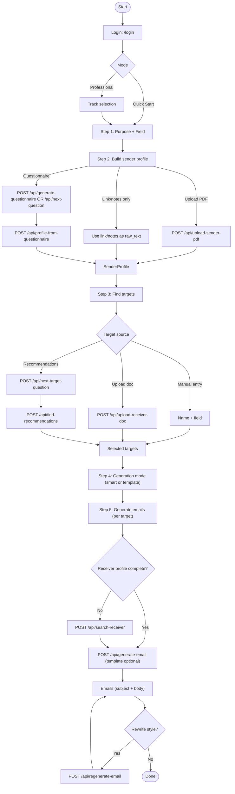

# Cold Email Generator

An intelligent cold email generation tool with a step-by-step wizard interface.

🌐 **Live Demo**: [https://coldemail-agent.onrender.com/](https://coldemail-agent.onrender.com/)

## Workflow

High-level workflow of the wizard UI (`templates/index_v2.html`) and backend APIs (`app.py`):



## Features

### v3.0 (Current) - Mode Selection & Privacy 🎯

- **Mode Selection After Login**
  - **Quick Start Mode**: For users without a resume
    - No resume upload required
    - Optional: add resume/profile link/notes; otherwise answer a 5-question questionnaire
    - Perfect for beginners or quick outreach
  - **Professional Mode**: For users with a resume
    - Resume upload required
    - Track selection: Finance or Academic
    - Target options: Have targets vs Need recommendations
    - Tailored preference questions based on track

- **Privacy Notice Modal**
  - Clear data usage policy displayed after mode selection
  - Explains how AI processes data
  - Confirms data security and no permanent storage

- **Track-Specific Preferences**
  - Finance: Investment banking, Asset management, Private equity, Consulting
  - Academic: Research collaboration, PhD applications, Postdoc positions, Academic networking

### v2.2 - Gemini Google Search Integration 🔍

- **Real-time Web Search for Recommendations**
  - Uses Gemini's built-in Google Search grounding
  - Finds REAL people with verified current positions
  - No more DuckDuckGo timeout errors on cloud servers
  - Faster and more reliable than external web scraping

- **Bug Fixes**
  - Fixed: OpenAI `web_search` tool type not supported (400 error)
  - Fixed: DuckDuckGo search timeout on Render.com
  - Fixed: Step 1 Field selection was missing after merge

### v2.1 - Enhanced Target Management

- **Manual Target Document Upload**
  - Upload PDF, TXT, or MD files with target's information
  - Auto-extracts profile data using AI
  - Skips web search when document is provided

- **Target Profile Preview**
  - Click "📋 View" to see detailed profile before selecting
  - View match score, position, education, experience, skills, projects
  - Select target directly from the profile modal

### v2.0 - Web Interface with Smart Wizard

- **Step 1: Purpose Selection**
  - 4 purpose categories: Academic Outreach 🎓, Job Seeking 💼, Coffee Chat ☕, Other ✨
  - 4 field categories: AI/ML 🤖, Software Engineering 💻, Finance/Fintech 📈, Other 🔬
  - Custom input support for both

- **Step 2: Build Your Profile**
  - Option A: Upload PDF resume (recommended)
  - Option B: Quick 5-question questionnaire to build profile
    - Each question has 4 options including custom input

- **Step 3: Find Targets**
  - Manual input: Enter name and field directly
  - **NEW**: Upload target's document (PDF/TXT/MD)
  - AI Recommendations: Get top 10 matching contacts based on your profile
    - **NEW**: Click "📋 View" to see target profile
    - Multi-select targets for batch email generation
    - Options to generate more or add manually

- **Step 4: Generate & Customize Email**
  - Regenerate with different styles:
    - 📋 More Professional
    - 😊 More Friendly
    - ✂️ More Concise
    - 📝 More Detailed
    - ✏️ Custom instructions
  - Edit Subject/Body and copy subject, email, or all emails

### v1.x - CLI Tool

- **v1.2**: Switched to Google Gemini API
- **v1.1**: Web search for receiver info (name + field only)
- **v1.0**: PDF resume parsing
- **v0**: JSON input support

## Quick Start

### Web Interface (Recommended)

1. Visit [https://coldemail-agent.onrender.com/](https://coldemail-agent.onrender.com/)
2. Enter password: `gogogochufalo`
3. **Choose your mode:**
   - **Quick Start**: No resume? Build profile via questionnaire
   - **Professional**: Upload resume, choose Finance or Academic track
4. Review privacy notice and continue
5. Follow the wizard steps to generate your cold email

### Local Development

1. Install dependencies:
   ```bash
   pip install -r requirements.txt
   ```

2. Set up Google Gemini API Key:
   ```bash
   export GEMINI_API_KEY=your_api_key
   ```
   Get your API Key: https://makersuite.google.com/app/apikey

3. Run the web app:
   ```bash
   python app.py
   ```

4. Open http://localhost:5000 in your browser

### CLI Usage

#### Web Search Input

```bash
python -m src.cli \
  --sender-pdf /path/to/sender.pdf \
  --receiver-name "Andrew Ng" \
  --receiver-field "AI research, deep learning" \
  --motivation "Why you want to reach out" \
  --ask "What you hope they can help with" \
  --goal "Request a 20-min chat to discuss their recent projects"
```

#### PDF Input

```bash
python -m src.cli \
  --sender-pdf /path/to/sender.pdf \
  --receiver-pdf /path/to/receiver.pdf \
  --motivation "Why you want to reach out" \
  --ask "What you hope they can help with" \
  --goal "Request a 20-min chat"
```

#### JSON Input (v0 Compatible)

```bash
python -m src.cli \
  --sender-json examples/sender.json \
  --receiver-json examples/receiver.json \
  --goal "Request a 20-min chat"
```

## Tech Stack

- **Backend**: Python, Flask, Google Gemini API
- **Frontend**: HTML, CSS, JavaScript
- **Deployment**: Render.com
- **PDF Parsing**: PyPDF2
- **Web Scraping**: BeautifulSoup4, Requests

## License

MIT
